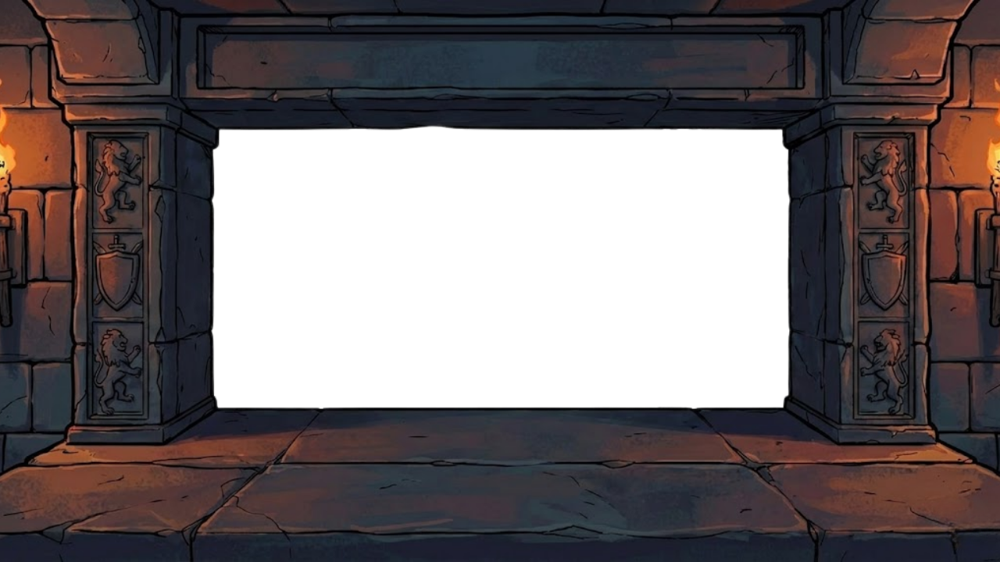
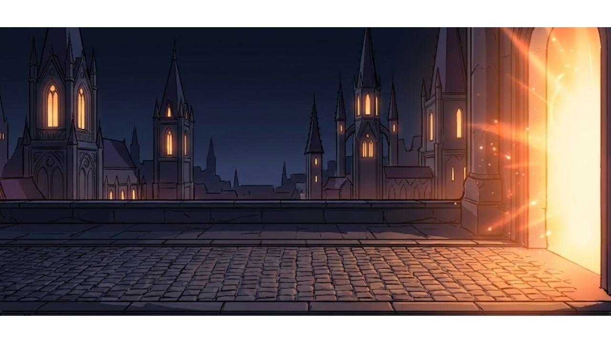
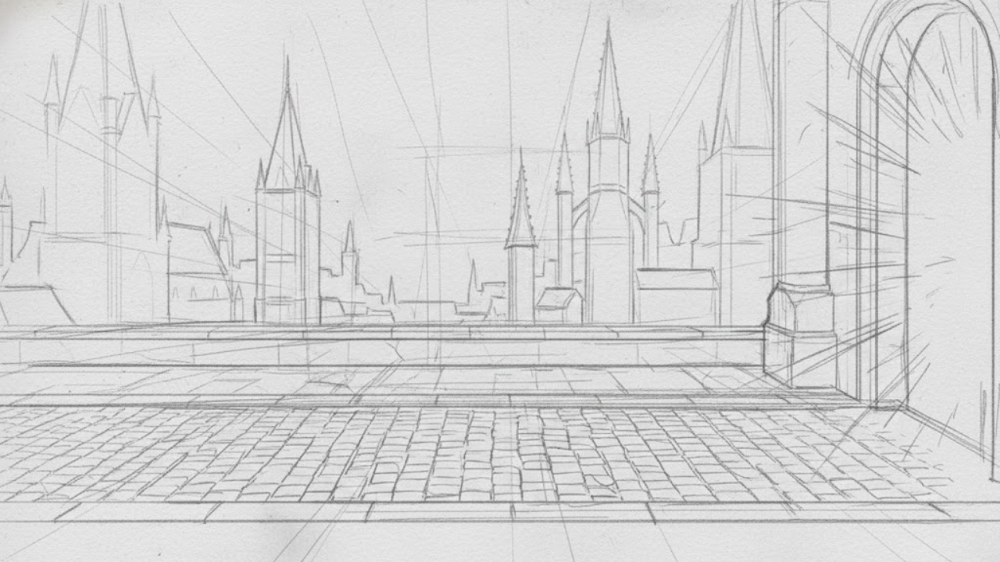

# 🎭 Match the Mask — Environment Art

Environment and scene art for **Match the Mask**, a game made in 48 hours at **Global Game Jam 2026** (theme: *Mask*) by the **ARTSCIM Community** team. This repository holds the hand-drawn environment artwork I created for the game — built up layer by layer, from rough sketch to final render.

> 🗂️ This is an **art / asset showcase**. To actually play the game, head to the team's official page → **[adityaadnyana.itch.io/match-the-mask](https://adityaadnyana.itch.io/match-the-mask)**

---

## ▶️ Play the game

The playable build lives on the team's **official itch.io page** — this repo is just the art:

**→ [adityaadnyana.itch.io/match-the-mask](https://adityaadnyana.itch.io/match-the-mask)**

## 🎭 About the game

You play a **gate guardian** at a grand masquerade party, matching the right party masks to each arriving guest. It's a *Match → Upgrade* loop: level up the party to earn more per second, keep your health up through the shop, and survive as many nights as you can. Built in **Godot 4** (GDScript). Genre: rhythm · comedy · medieval.

## 🎨 My contribution

I'm **Gian Angely** — **2D Artist, Environment Designer & Game Designer** on the team. Everything in this repository is environment art I drew for the game: the night-time city, the guardian's stone gate, and the ballroom scene.

## 🖼️ The scenes

Shown at the top: **the guardian's gate** — a stone archway with heraldic lions, sword-and-shield crests, and lit torches; the foreground frame the gameplay plays through.

**The night city** — a gothic skyline at dusk, warm light spilling from the gateway onto the cobblestones:

## ✏️ Process

Every scene is drawn through the full illustration process. Here's the background, from perspective sketch to final render:

<table>
  <tr>
    <td align="center"> <b>1</b> · Sketch</td>
    <td align="center"> <b>2</b> · Line art</td>
    <td align="center"> <b>3</b> · Flat color</td>
    <td align="center"> <b>4</b> · Shading</td>
    <td align="center"> <b>5</b> · Final</td>
  </tr>
</table>

## 📁 Repository structure

Three layer groups, each drawn through `sketch → line art → flat color → shading → finish`:

| Folder | Contents |
|---|---|
| **`background/`** | The night city & gate approach — arches, spires, cobblestones |
| **`foreground/`** | The gate frame — stone, heraldry, torches, cast shadows |
| **`pesta/`** | The finished ballroom party scene, lit and sparkling (*pesta* = "party") |

## 🛠️ Tools

Adobe Photoshop · Krita. All illustrations are original.

## 👥 Credits — Team ARTSCIM Community

*Global Game Jam 2026 · Godot 4 · GDScript*

| Member | Role |
|---|---|
| I Putu Gde Aditya Stiti Adnyana | Project Lead · Game Designer · Programmer · Integration · QA |
| **Gian Angely** *(this repo)* | **2D Artist · Environment Designer · Game Designer** |
| I Gede Wahyu Widiatmika | 2D Animator · Game Designer |
| I Putu Ade Rangga Putra | UI Designer · Game Designer |

## 🔗 Links

- ▶️ **Play the game (itch.io):** [adityaadnyana.itch.io/match-the-mask](https://adityaadnyana.itch.io/match-the-mask)
- 🌐 **Global Game Jam 2026:** [globalgamejam.org/games/2026/match-mask-6](https://globalgamejam.org/games/2026/match-mask-6)
- 💻 **Game source (team):** [github.com/AdityaAdnyana/game-pencocokkan-topeng](https://github.com/AdityaAdnyana/game-pencocokkan-topeng)

## 📄 Usage & credits

All artwork here is original, created by **Gian Angely** for the project. *Match the Mask* is a collaborative Global Game Jam 2026 project — the game itself, its code, and other assets belong to the full **ARTSCIM Community** team. Please keep credit intact and reach out before reusing the art.
