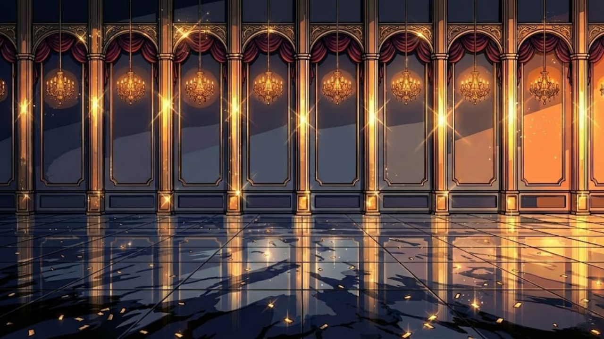

# Match the Mask

Environment and scene art for **Match the Mask**, a masquerade-ball game made for Game Jam 2026. This repo holds the hand-drawn artwork — a grand ballroom scene built up layer by layer, from rough sketch to the final sparkle-lit render.

## The artwork

The ballroom is composed from three layer groups, each drawn through the full illustration process (sketch → line art → flat color → shading → finish):

- **`background/`** — the hall itself: arches, windows, curtains, and paneling
- **`foreground/`** — set pieces: torches, stone, and cast shadows
- **`pesta/`** — the finished party scene, lit and sparkling (*pesta* = "party")

## Process

Each scene moves through stages you can follow in the files: `skets` (sketch) → `line art` → `flat color` / `half color` → `shading` → `berkilau` (the final, glimmering render).

## Note

Art assets for a Game Jam 2026 project. All illustrations are original.
